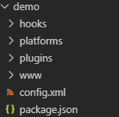

# cordova
 cordova + vue

 ### 环境配置

1. 安装cordova :  `npm install -g cordova` , 安装完成后 `cordova -v`检查版本
2. 创建demo : `cordova create demo` 生成如下目录结构

    
    * config.xml --- 配置页, 程序图标, 项目名称等
    * hooks --- 自定义扩展
    * platform --- 存放添加的运行平台
    * www --- 内容开发目录
  
3. 添加平台 : 
    ``` 
    cordova platform add android --save

    cordova platform add ios --save

    cordova platform add browser --save
    ```
4. 添加完平台之后，我们可以使用 cordova run < platform > 来运行相应平台的代码，作为前端开发者，我们可以首先在浏览器里面跑起来我们的项目：cordova run browser （前提是你前面添加了 browser 平台）

5. 安装配置 Android SDK (AMD cpu)
    * 确认电脑电脑打开虚拟化
    * 确认电脑打开 Hyper-V管理工具 , Hyper-V平台
    * 确认电脑没有配置过安卓 adb工具(手动添加到path)
    1. 下载安装Android SDK (具体搜索相关资料)
    2. 下载安装Java JDK (具体搜索相关资料)
    3. 打开Android SDK, 创建虚拟设备(版本看需求, 具体搜索相关资料)
        * 如果提示不支持svm, 就是没有打开虚拟化跟Hyper-V
    4. 打开虚拟设备, 就跟手机差不多吧, 在demo目录下 `cordova run android` 就可以字虚拟设备上看效果了.
        * 如果报错, 在demo目录下输入 `cordova requirements` 可以检查错误内容.
        * 如果错误内容为 `gradle` 相关, 手动下载完整 [Gradle](https://gradle.org/releases) ,配置到 path 即可.

[参考链接：https://www.jianshu.com/p/2e9bebb73d37](https://www.jianshu.com/p/2e9bebb73d37)

[参考链接：https://blog.csdn.net/bluefish_flying/article/details/78012262](https://blog.csdn.net/bluefish_flying/article/details/78012262)


### vue cli3 配置问题
* vue.config.js: 
  
  ```js 
    module.exports = {
        publicPath: './',//必须
        outputDir:'../demo/www'//参考
    }
  ```
* App.vue:  

  ```js 
    created() {
    this.$router.push("/")
  }
  ```
  * 如果你的`App.vue`不充当切换路由的作用(仅仅用作`<router-view>`)必须重新插入一个起始路径, 因为程序打包打开方式跟本地打开html文件差不多 ( 类似`http://localhost:8000/index.html` ) , 路由起始的定向都会失效 , 会出现画面空白的情况. 应该还有其他更好解决的办法, 目前暂且这样解决. 


### cordova 事件(android)
* 所有事件的使用都是类似 dom 事件操作:
  ``` js
    document.addEventListener("deviceready", () => {
        console.log("ok")
    })
  ```
1. deviceready : 当Cordova完全加载好deviceready事件会触发。这个事件对每一个应用程序都是必须的。他是Cordova设备API准备好并可以访问的信号.
2. pause : 当原生平台把应用程序放入后台这个pause事件会触发，通常是用户切换到了不同的应用程序.
3. resume : 当原生平台将应用程序从后台运行拉出resume事件就会触发.
4. backbutton : 当用户按下返回按钮事件触发，如果你需要重写默写行为你可以注册backbutton事件监听。不在需要其他调用方法来重写返回按钮的行为.
5. menubutton : 当用户按下菜单按钮事件触发，如果你需要重写默写行为你可以注册menubutton事件监听.
6. searchbutton : Android中当用户按下搜索按钮事件触发，如果你需要重写默写行为你可以注册'searchbutton'事件监听. 


[参考链接：http://cordova.axuer.com/docs/zh-cn/latest/cordova/events/events.html](http://cordova.axuer.com/docs/zh-cn/latest/cordova/events/events.html)

### cordova 插件(android)
1. cordova-plugin-battery-status :
   * `cordova plugin add cordova-plugin-battery-status`
   * 该插件可以监听设备电池的变化, 提供三个事件
   * batterystatus : 表示电池状态的改变(至少1%, 或者充电状态的改变触发)
   * batterycritical : 表示电池进入临界状态, 快关机时触发
   * batterylow : 表示电池电量比较低,触发
   * 所有事件都会返回一个 Status object , 包含
       * level(电量): The battery charge percentage (0-100). (Number)
       * isPlugged(是否在充电): A boolean that indicates whether the device is plugged in. (Boolean)
   * 注意: 插件事件的监听及插件方法的调用, 一定要在 deviceready 装备完成之后调用.
   * 例子: 
        ``` js
        window.addEventListener("batterystatus", onBatteryStatus, false);

        function onBatteryStatus(status) {
            console.log("Level: " + status.level + " isPlugged: " + status.isPlugged);
        }
        ```

### cordova 打包跨域

https


